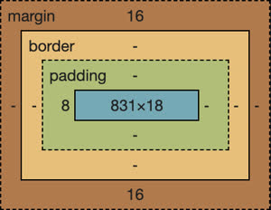

# CSS Notes
CSS makes things look nice and pretty, if you use it right.

## CSS and HTML
In order to make HTML stuff look pretty, there's a few ways to use CSS.

* You can use the *style attribute* on a specific element within HTML. 1st precedence.
```
<p style="color:green">CSS</p>
```
* You can use the *style element* in the *head* section of an html file to specify a stylistic choice for all of a particular element in the file. (THIS USES CURLY BRACES.) 2nd precedence.
```
<head>
  <style>
    p {
      color: green;
    }
  </style>
</head>
<body>
  <p>CSS</p>
</body>
```
* OR you can use an html link in the head to create a hyperlink to an external file containing CSS rules. 3rd precedence.
```
<link rel="stylesheet" href="styles.css"/>
```
```
p {
  color:green;
}
```
Best Practice: Put rules for the highest levels in the DOM higher in the document. That way, you aren't writing over broad groups of things after apply details to more specified areas.

*CSS defines things as boxes. Think the box model.*



### Accessing CSS files from html files

In order to access a CSS file, you need to put a reference to the file in the HEAD section.

Example:
```
<!--Make sure everything is linked to CSS!-->
    <link rel="stylesheet" href="main.css"/>

    <!--Link to bootstrap CSS framework-->
    <link 
        href="https://cdn.jsdelivr.net/npm/bootstrap@5.2.2/dist/css/bootstrap.min.css"
        rel="stylesheet"
        integrity="sha384-Zenh87qX5JnK2Jl0vWa8Ck2rdkQ2Bzep5IDxbcnCeuOxjzrPF/et3URy9Bv1WTRi"
        crossorigin="anonymous"
        />
```
The main.css file contains general, overarching rules that more or less apply to every file. However, other css files can also be linked with instructions for specifics that only apply to some of the html files.


## Accessing particular areas within DOM


## Flex

Flex is how we make interfaces stretch and condense, depending on the size of the screen and the size of the window.

To make flex apply to a body or some other element, do this: 
```
body {
  display: flex;
  flex-direction: column /* or row */
  margin: 0
  height: 100vh;
}
```

For something NOT to flex:
```
header {
  flex: 0 80px;
  /* makes it so the area doesn't flex at all, but stays set at 80 px. */
}
```

For sections within main to flex:

```
main {
  flex: 1; /*makes it so it can flex*/
  display: flex;
  flex-direction: row; /*makes it so it will flex horizontally*/
}

/* make sure to use nth child wording. It won't work without it.*/
section:nth-child(1) {
  flex: 1; /*this is a proportion of 1 to whatever the proportions of the other sections are. */
}

section:nth-child(2) {
  flex: 3; /*So a 1 to 3 ratio.*/
}
```

### Media Query
Media query allows us to work with different screen sizes.

## Bootstrap

Bootstrap is a CSS framework that basically does a lot of the legwork for you as far as CSS goes.
In order to use it, you need to have the following tag in the head of your html files:

```
<meta name="viewport" content="width=device-width, initial-scale=1">
```
(Specifically the viewport part, although the other parts are probably things you want, too. This makes mobile devices structure properly.)

Still in head, enter in this tag:

```
  <link href="https://cdn.jsdelivr.net/npm/bootstrap@5.2.3/dist/css/bootstrap.min.css" rel="stylesheet" integrity="sha384-rbsA2VBKQhggwzxH7pPCaAqO46MgnOM80zW1RWuH61DGLwZJEdK2Kadq2F9CUG65" crossorigin="anonymous">
```
(Allows Bootstrap's CSS to work.)


***AT THE END*** of the body, put this:

```
<script src="https://cdn.jsdelivr.net/npm/bootstrap@5.2.3/dist/js/bootstrap.bundle.min.js" integrity="sha384-kenU1KFdBIe4zVF0s0G1M5b4hcpxyD9F7jL+jjXkk+Q2h455rYXK/7HAuoJl+0I4" crossorigin="anonymous"></script>
```

(Allows Bootstrap's JavaScript to work.)

Also, for Popper (which includes dropdown menus and tips), enter the following:

```
<script src="https://cdn.jsdelivr.net/npm/@popperjs/core@2.11.6/dist/umd/popper.min.js" integrity="sha384-oBqDVmMz9ATKxIep9tiCxS/Z9fNfEXiDAYTujMAeBAsjFuCZSmKbSSUnQlmh/jp3" crossorigin="anonymous"></script>
<script src="https://cdn.jsdelivr.net/npm/bootstrap@5.2.3/dist/js/bootstrap.min.js" integrity="sha384-cuYeSxntonz0PPNlHhBs68uyIAVpIIOZZ5JqeqvYYIcEL727kskC66kF92t6Xl2V" crossorigin="anonymous"></script>
```

Example Buttons:

```
// Bootstrap styled button
<button type="button" class="btn btn-primary">Bootstrap</button>

// Default browser styled button
<button type="button">Plain</button>
```