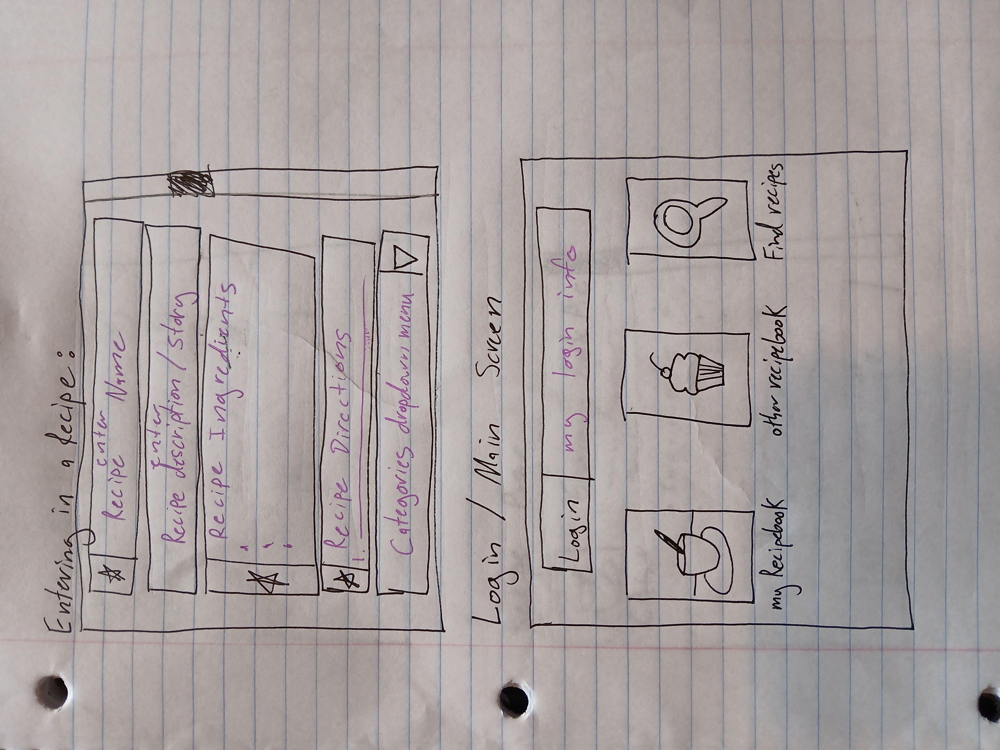
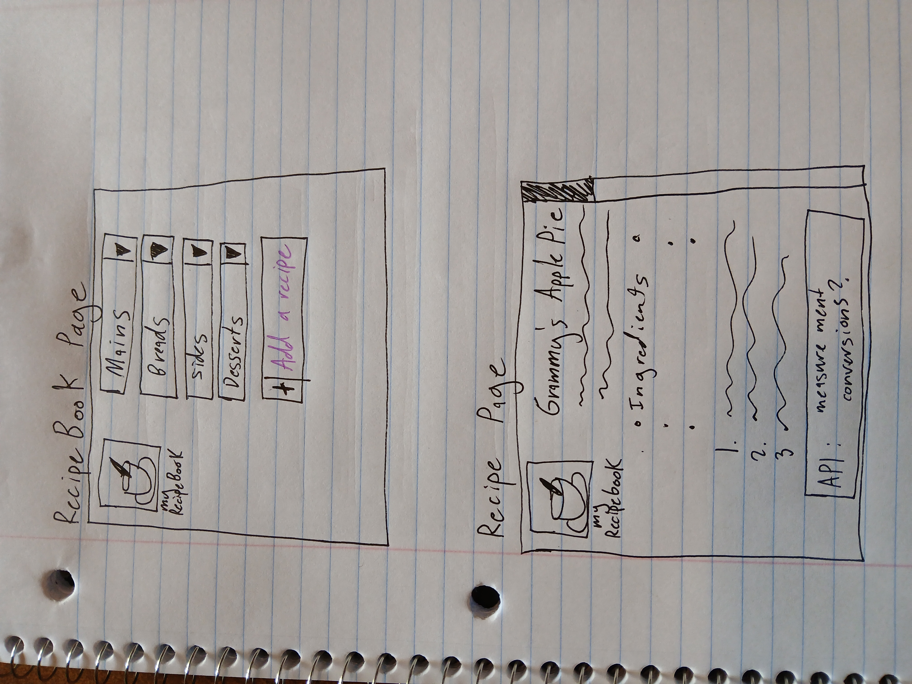

# Startup
startup application for CS 260

### Notes
This repository contains a [notes.md file](./notes.md), which contains class notes.

# Family Recipebook Application

## Specification Deliverable
This section contains the details required in the startup specification assignment. 

### Elevator pitch

Nothing seems to bring family together quite like Grammy's apple pie, Dad's grilled pork chops, or Great great Aunt Tilly's closely-guarded rhubarb crumble. By sharing and passing down these recipes, we can create rich family traditions and keep the memory of our loved ones close by, even if they have passed or live far away. This application will format, categorize, and alphabetize recipes that users enter into an online, sharable recipebook that the whole extended family can have access to, without the risk of the recipes getting lost or damaged over years of use.

### Design

### Key Features

* Secure login over HTTPS
* Allow user input
* Format, categorize, and alphabetize based on user input
* Allow users to view the recipebooks of other users
* Allow users to search for particular recipes

### Technologies

I will use the following technologies in the ways listed below:
* **HTML** : Use correct HTML structure for application.
* **CSS**  : Use for application styling on different screen sizes, format input in an appealing way.
* **React** : Provides login and choice display.
* **Service** : Backend service with endpoints for login and retrieving choices and input.
* **DB/Login** : Stores users, choices, and formatted input. Register and login users. Credentials securely stored in database.
* **Websocket** : Allows users to see the recipebooks of other users.

### HTML Deliverable

For this deliverable, I structured my startup application using HTML.

- [x] **HTML** : 7 HTML pages that include the following pages: home with login, creating a recipebook, a menu of one's own recipe book, a form to add a new recipe, a list of others' recipe books, a menu of another's recipe book, and the structure that all recipes will use.
- [x] **Links** : Each page has an option to navigate to one or multiple other pages, either through hyperlinks or linked images. In addition, the recipe menu has links to placeholders for actual recipes.
- [x] **Text** : There are text headers and text descriptions on the forms. The recipe itself will be completely text, although right now I have just put in placeholders for the actual text.
- [x] **Images** : I put in placeholders for the images. I plan to use a third-party service to supply pictures of food as the cover of each recipebook. I also put in a placeholder for an image in the tab.
- [x] **DB/Login** : There is an input box and submit button for login, creating new recipe books, and creating new recipes. The recipes themselves will be formatted directly from the input data.
- [x] **Websocket** : Each recipebook is accessible by any user, although users can only add to recipebooks that they have made. Recipebooks will be updated live. 

### CSS Deliverable

For this deliverable, I formatted the appearance of my application.

- [x] **Header, Footer, and Main Body Content**: I have all of these.
- [x] **Navigation Elements**: I added a navigation menu in the header for all of the pages. I also have several buttons that have links.
- [x] **Responsive to Window Resizing**: Flex has been applied, so the app should adjust well.
- [x] **Application Elements**: Played with color scheme, should have good contrast.
- [x] **Application Images**: Application has images that have been sized appropriately.

### React Deliverable

For this deliverable, I used Javascript and React so that the application could be interactive. I also added placeholders for later units.

- [] **Bundled and Transpiled**: I bundled and transpiled my old html code.
- [] **Components**: 
    - [] **Login**:
    - [] **Database**:
    - [] **WebSocket**:
    - [] **Application Logic**:
- [X] **Router**: I created a router for injecting code into main in between header and footer.
- [] **Hooks**: